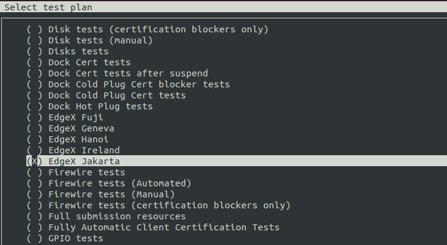
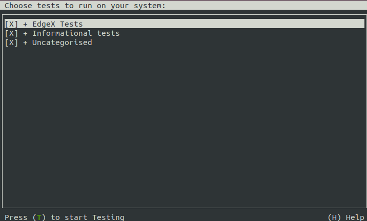

# edgex-checkbox-provider

## Introduction

This project contains the checkbox tests of the [Edgex Foundry](https://docs.edgexfoundry.org/) snaps.
[Checkbox](https://checkbox.readthedocs.io/en/latest/) is a test automation software performed by the Canonical certification team. 
The [upstream repository](/../../) is hosted on Github; 
The tests run via the [Launchpad mirror](https://code.launchpad.net/checkbox-provider-edgex).

When edgexfoundry snap is released to a $TRACK/beta channel, the corresponding checkbox test will be triggered. 

## Usage
### Run tests using checkbox-edgexfoundry snap in isolation (recommend)
```bash
sudo snap install checkbox-edgexfoundry --devmode --channel=latest/edge
```
checkbox-edgexfoundry snap depends on extra environment variables, so setting test channel and release name:
```bash
sudo DEFAULT_TEST_CHANNEL=<"channel"> checkbox-edgexfoundry.<release name>
# Here is an example
sudo DEFAULT_TEST_CHANNEL="2.1/beta" checkbox-edgexfoundry.jakarta

```
### Run tests using checkbox CLI
```bash
cd edgex-checkbox-provider/
sudo ./manage.py install
checkbox-cli
```


Press SPACE to select an EdgeX test plan, then choose tests to run on your system:



### Run tests locally
Remove these snaps to avoid missing edgex-secretstore-token issue, if applicable:
```bash
snap remove --purge <edgex-device-service>
snap remove --purge <edgex-app-service>
```
Get the edgex-checkbox-provider:
```bash
cd edgex-checkbox-provider/data/jakarta
```
Download a specific version snap:
```bash
snap download edgexfoundry <channel>
sudo ./run-all-tests-locally.sh -s <edgexfoundry.snap> -t <single test>
```
Here are some examples:

```bash
# run a single test using locally built snaps
snap download edgexfoundry --channel=2.1/stable
sudo ./run-all-tests-locally.sh -s edgexfoundry_3375.snap -t test-rules-engine.sh
```
```bash
# run all tests using locally built snaps
sudo ./run-all-tests-locally.sh-s edgexfoundry_3375.snap
```
```bash
# run a single test using snap from latest/beta channel
sudo ./run-all-tests-locally.sh -t test-rules-engine.sh
```
```bash
# run all tests using snap from latest/beta channel
sudo ./run-all-tests-locally.sh
```
```bash
# run tests showing output of tests even if passed
sudo ./run-all-tests-locally.sh -t -v
sudo ./run-all-tests-locally.sh -t test-install.sh -v
```
```bash
# get a list of available options
sudo ./run-all-tests-locally.sh -h
```

## Testing coverage
- Test installation of EdgeX snap
- Test security services proxy certs work properly
- Test that all services can be started properly
- Test that installing uses "current" based file paths in config files
- Test that refreshing uses "current" based file paths in config files
- Test that services start after refreshing 
- Test that services start after refreshing to this revision from self
- Test that the system management agent works with the snap
- Test that services are not listening on external network interfaces
- Test that the rules engine works with the snap
- Mandatory tests: interface, meminfo, connections ,[etc](./units/test-plan.pxu#L113).

## Limitations
- The current tests plan only covers [edgexfoundry snap](https://github.com/edgexfoundry/edgex-go/tree/main/snap), it does not cover [device services snaps](https://github.com/edgexfoundry/edgex-docs/blob/main/docs_src/getting-started/Ch-GettingStartedSnapUsers.md#device-service-snaps) and [app services snap](https://github.com/edgexfoundry/app-service-configurable/tree/main/snap)
- edgex-secretstore-token content interface is not be covered by tests

